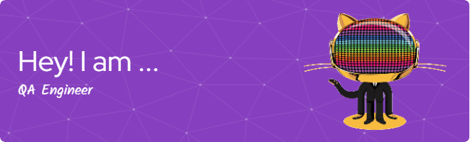

Hi My name is Pao Holguin
===================================================================================================================================

I'm a QA Engineer passionate about ensuring the quality and reliability of software applications. With experience in manual and automated testing, I specialize in finding bugs before they find the end-users. Welcome to my GitHub profile, where you can explore my projects, contributions, and some of the tools I love working with.| AI Enthusiastic
-----------------------------------------------------------------------------------------------------------------------------------------------------------------------------------------------------------------------------------------------------------------------------------------------------------------------------------------------------------

🚀 Skills & Technologies - \*\*Manual Testing:\*\* Functional, Regression, Usability, and Exploratory Testing. - \*\*Programming Languages:\*\* Python. - \*\*Tools & Frameworks:\*\* JIRA, Postman. - \*\*Continuous Integration/Continuous Deployment (CI/CD):\*\* GitHub Actions, GitLab CI. - \*\*Version Control:\*\* GitHub. - \*\*Bug Tracking & Test Management:\*\* JIRA. - \*\*Other:\*\* SQL, REST API.

* 🌍  I'm based in Madrid
* ✉️  You can contact me at [paolaholguinmercado@gmail.com, www.linkedin.com/in/paoholguin](mailto:paolaholguinmercado@gmail.com, www.linkedin.com/in/paoholguin)
* 🧠  I'm learning Q.A. Engineer in Triple Ten
* 🤝  I'm open to collaborating on I am always open to collaborating on projects related to testing, automation, and software quality assurance. If you have any exciting projects or ideas, feel free to reach out!
* ⚡  Thank you for visiting my GitHub profile! 😊

### Skills

### Socials

 <a href="https://discord.com/users/bclpaola" target="_blank" rel="noreferrer"> <picture> <source media="(prefers-color-scheme: dark)" srcset="https://raw.githubusercontent.com/danielcranney/readme-generator/main/public/icons/socials/discord-dark.svg" /> <source media="(prefers-color-scheme: light)" srcset="https://raw.githubusercontent.com/danielcranney/readme-generator/main/public/icons/socials/discord.svg" />  </picture> </a> <a href="https://www.github.com/paoholguin" target="_blank" rel="noreferrer"> <picture> <source media="(prefers-color-scheme: dark)" srcset="https://raw.githubusercontent.com/danielcranney/readme-generator/main/public/icons/socials/github-dark.svg" /> <source media="(prefers-color-scheme: light)" srcset="https://raw.githubusercontent.com/danielcranney/readme-generator/main/public/icons/socials/github.svg" />  </picture> </a> <a href="http://www.instagram.com/paoholguinm" target="_blank" rel="noreferrer"> <picture> <source media="(prefers-color-scheme: dark)" srcset="https://raw.githubusercontent.com/danielcranney/readme-generator/main/public/icons/socials/instagram-dark.svg" /> <source media="(prefers-color-scheme: light)" srcset="https://raw.githubusercontent.com/danielcranney/readme-generator/main/public/icons/socials/instagram.svg" />  </picture> </a> <a href="https://www.linkedin.com/in/paoholguin" target="_blank" rel="noreferrer"> <picture> <source media="(prefers-color-scheme: dark)" srcset="https://raw.githubusercontent.com/danielcranney/readme-generator/main/public/icons/socials/linkedin-dark.svg" /> <source media="(prefers-color-scheme: light)" srcset="https://raw.githubusercontent.com/danielcranney/readme-generator/main/public/icons/socials/linkedin.svg" />  </picture> </a>

### Support Me

<ul style="list-style-type: none; margin: 0;">

<li style="display: inline-block; margin-right: 0.25rem;"></li>

</ul>